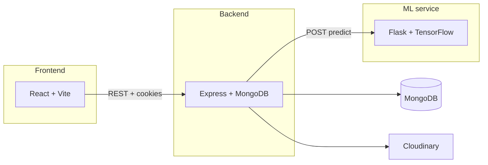

# Feed Connect — Food Donation Platform

A full-stack web application that connects **food donors** and **receivers**, with optional **machine learning** to estimate spoilage risk and suggest how long food stays suitable for donation. The product experience is branded as **Feed Connect** in the UI.

---

## What this project does

- **Donors** list surplus food (type, quantity, location), schedule **future events**, and respond to **receiver requests**. Donations can be enriched with ML-derived **spoilage risk** and **remaining fresh hours**, which feed into expiry timing.
- **Receivers** browse available donations, **claim** them, mark them **delivered**, post **requests** for food they need, and use **notifications** and **history** views.
- **Backend** ties it together with **MongoDB**, **JWT + cookies** for auth, **Cloudinary** for profile images, and an HTTP call to a **Flask ML service** when creating donations.
- **ML service** exposes a `/predict` endpoint: given `food_type` and `hours_since_prepared`, it returns `spoilage_risk` and `remaining_fresh_hours`.

---

## Features

| Area | Capabilities |
|------|----------------|
| **Accounts** | Register and login as **donor** or **receiver**; role-based routes on the frontend; JWT stored client-side with cookie-backed API calls where configured. |
| **Donations** | Create, list, and track donations with status (`available`, `matched`, `delivered`, `expired`); receivers can **claim** and **deliver**; donors see their listings and accepted flows. |
| **ML-assisted donation** | On `POST /api/donation`, the API calls the ML service (when reachable) to set `spoilageRisk`, `remainingFreshHours`, and prefer ML-based **expiry duration** when valid. If the ML service fails, the flow **degrades gracefully** and continues without ML fields. |
| **Requests** | Receivers create food requests; donors can see **available** requests, **accept**, and **deliver** through dedicated endpoints. |
| **Events** | Create and fetch **future events** for coordinated giving. |
| **Notifications** | In-app notifications (e.g. new donation available); mark read / mark all read. |
| **Statistics** | Donor- and receiver-specific stats endpoints for dashboards. |
| **Maps / location** | Frontend uses **Leaflet** / **react-leaflet** for location-related UI (e.g. picking or showing location). |
| **Landing** | Public dashboard with login/register entry points. |

---

## Architecture



1. **React (Vite)** in `frontend/` talks to the API using `VITE_BACKEND_URL` (default `http://localhost:8001`).
2. **Express** in `backend/ProjectBackend/` implements `/api/*` routes, validates JWTs, and persists data in **MongoDB**.
3. **Flask** in `backend/model_training/` loads a trained **Keras** model and preprocessors, and serves predictions used when creating donations.

---

## Tech stack

| Layer | Technologies |
|-------|----------------|
| **Frontend** | React 19, Vite 6, React Router 7, Tailwind CSS 4, Axios, Leaflet, Lucide icons |
| **Backend** | Node.js (ES modules), Express 5, Mongoose, JWT, Multer, Cloudinary, CORS, cookie-parser |
| **ML** | Python 3, Flask, TensorFlow (CPU), scikit-learn, pandas, joblib, Gunicorn (production) |

---

## Repository layout

```
Food/
├── frontend/                 # React SPA (Vite)
├── backend/
│   ├── ProjectBackend/       # Express API
│   └── model_training/       # Flask ML app + training scripts
├── render.yaml               # Example Render blueprint (API + ML web services)
└── .devcontainer/            # Optional dev container (Python-focused)
```

---

## Prerequisites

- **Node.js** (LTS recommended) for frontend and backend  
- **Python 3.11+** (see `backend/model_training/requirements.txt`) for the ML service  
- **MongoDB** (Atlas or local)  
- **Cloudinary** account if you use profile image uploads  
- **Trained model artifacts** for ML (see below)

---

## Local development

### 1. MongoDB and Cloudinary

Create a database and note the connection string. Configure Cloudinary if registration uses image uploads.

### 2. Backend (`backend/ProjectBackend/`)

```bash
cd backend/ProjectBackend
npm install
```

Create a `.env` file in `backend/ProjectBackend/` (values are examples):

| Variable | Purpose |
|----------|---------|
| `PORT` | API port (e.g. `8001` to match the frontend default) |
| `MONGO_URI` | MongoDB connection string |
| `JWT_SECRET_KEY` | Secret for signing JWTs (required by the code) |
| `CORS_ORIGIN` | Comma-separated allowed origins, e.g. `http://localhost:5173` |
| `ML_API_URL` | Full URL to ML predict endpoint, e.g. `http://127.0.0.1:5000/predict` |
| Cloudinary | `CLOUDINARY_CLOUD_NAME`, `CLOUDINARY_API_KEY`, `CLOUDINARY_API_SECRET` as used by your upload middleware |

Start:

```bash
npm run dev
# or
npm start
```

### 3. ML service (`backend/model_training/`)

The Flask app expects model and data files alongside `app.py` (e.g. `spoilage_model.h5`, encoder/scaler pickles, `spoilage_data_expanded.csv`). Train or copy artifacts from your pipeline; without them the service will not start.

```bash
cd backend/model_training
python -m venv .venv
# Windows: .venv\Scripts\activate
# macOS/Linux: source .venv/bin/activate
pip install -r requirements.txt
python app.py
```

Default port in code is **5000** unless `PORT` is set.

### 4. Frontend (`frontend/`)

```bash
cd frontend
npm install
```

Optional: create `frontend/.env` with:

```env
VITE_BACKEND_URL=http://localhost:8001
```

Start:

```bash
npm run dev
```

Open the URL Vite prints (typically `http://localhost:5173`).

---

## ML API contract

`POST /predict` with JSON body:

```json
{
  "food_type": "Rice",
  "hours_since_prepared": 2.5
}
```

Example response:

```json
{
  "spoilage_risk": "Low",
  "remaining_fresh_hours": 4.25
}
```

The Node middleware maps donation fields (`foodName`, `hoursSincePrepared` or `preparedAt`) to this shape before calling `ML_API_URL`.